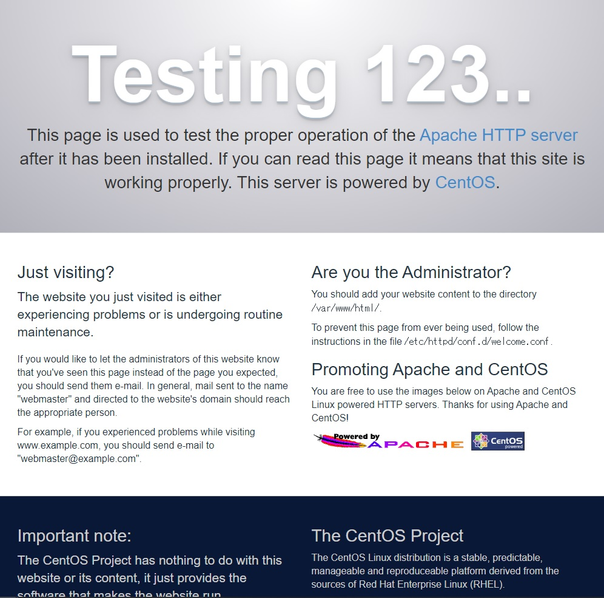
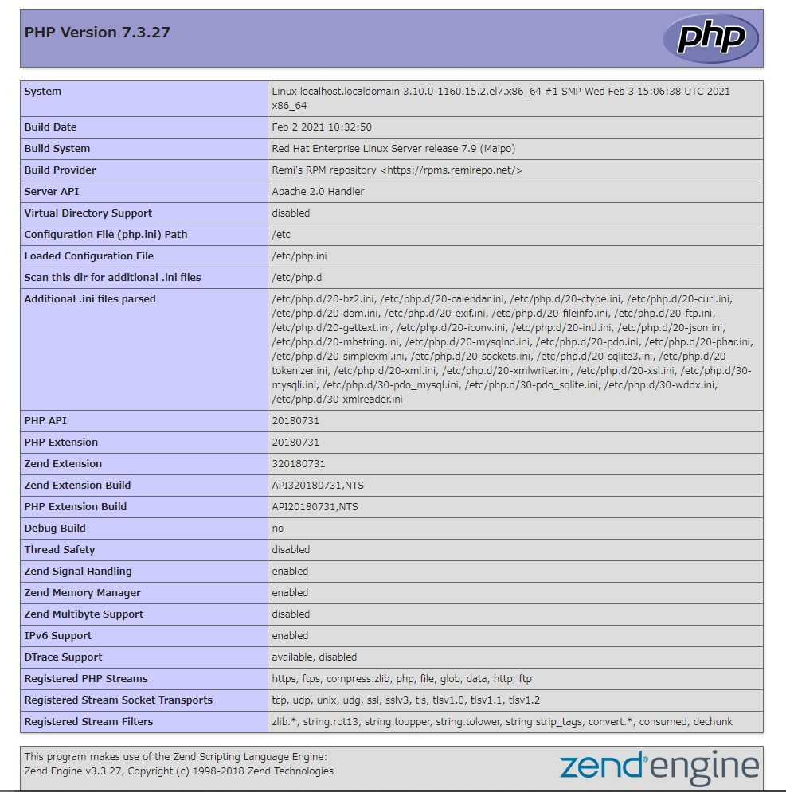
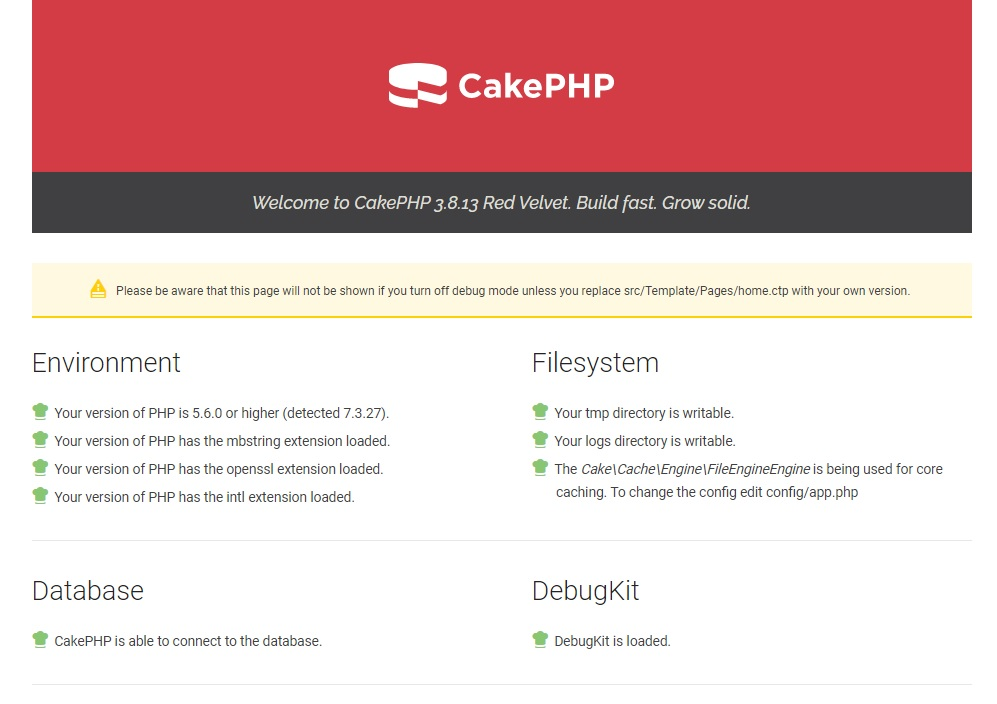
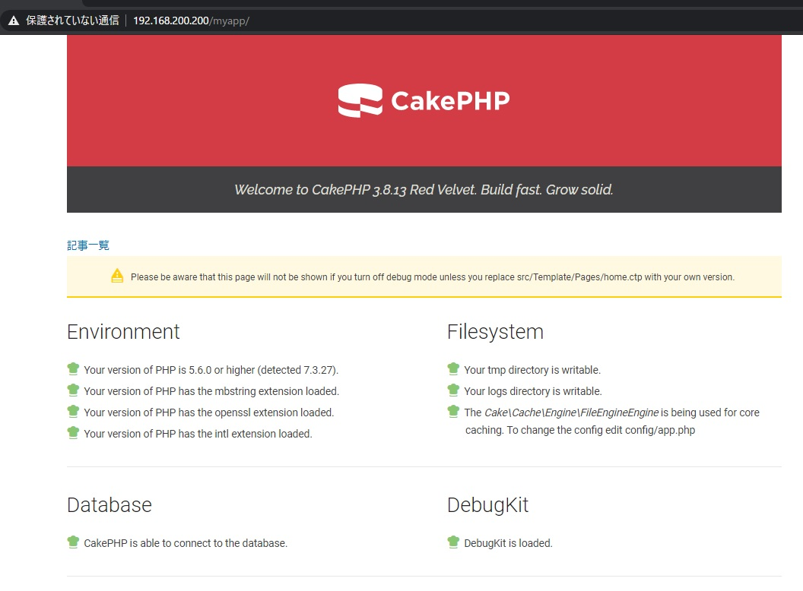

## はじめに

- VirtualBoxに、CentOS7.9環境を構築済

### Selinux無効化(セキュリティリスクの無い環境でのみ)

> /etc/selinux/config

```txt:/etc/selinux/config
SELINUX=disabled
```

### firewalld無効化(セキュリティリスクの無い環境でのみ)

- ※もしくは、http(80), https(443)のアクセスを許可

```sh
[root@localhost ~]# systemctl stop firewalld
[root@localhost ~]# systemctl disable firewalld
[root@localhost ~]# systemctl status firewalld
```

### reboot

```sh
[root@localhost ~]# reboot
```

### パッケージの最新化

```sh
[root@localhost ~]# yum -y update
```

-----

### Apacheのインストール

```sh
[root@localhost ~]# yum -y install httpd
```

**httpdサービスの起動**

```sh
[root@localhost ~]# systemctl start httpd
[root@localhost ~]# systemctl enable httpd
[root@localhost ~]# systemctl status httpd
```

**Listenポートの確認**

```sh
[root@localhost ~]# ss -ltnp
```

**Apache動作確認(CLI)**

```sh
[root@localhost ~]# curl http://localhost/
```

**Apache動作確認(ブラウザ)**



-----

### PHPのインストール

**PHP7リポジトリ追加**

- [epel](https://fedoraproject.org/wiki/EPEL/ja)
- [remirepo](https://rpms.remirepo.net/) ※自己責任で。

```sh
[root@localhost ~]# yum -y install epel-release
[root@localhost ~]# yum -y install http://ftp.riken.jp/Linux/remi/enterprise/remi-release-7.rpm
```

**PHP7のインストール**

- [CakePHP3.xのインストール要件]
  - PHP >= 5.6 (PHP7.4も含む)
  - mbstring PHP拡張
  - intl PHP拡張
  - simplexml PHP拡張
  - pdo PHP拡張
  - php-mysqlnd PHP拡張

```sh
[root@localhost ~]# yum -y install --enablerepo=remi-php73 php
[root@localhost ~]# yum -y install --enablerepo=remi-php73 php-mbstring
[root@localhost ~]# yum -y install --enablerepo=remi-php73 php-intl
[root@localhost ~]# yum -y install --enablerepo=remi-php73 php-xml
[root@localhost ~]# yum -y install --enablerepo=remi-php73 php-pdo
[root@localhost ~]# yum -y install --enablerepo=remi-php73 php-mysqlnd
```

#### PHP初期設定

> /etc/php.ini

**タイムゾーンの指定**

```ini
[Date]
; Defines the default timezone used by the date functions
; http://php.net/date.timezone
date.timezone = Asia/Tokyo
```

**拡張モジュールディレクトリの指定**

```ini
; Directory in which the loadable extensions (modules) reside.
; http://php.net/extension-dir
extension_dir = "/usr/lib64/php/modules/"
; On windows:
;extension_dir = "ext"
```

**httpdサービスの再起動**

```sh
[root@localhost ~]# systemctl restart httpd
```

**PHPバージョン確認**

```sh
[root@localhost ~]# php -v
PHP 7.3.27 (cli) (built: Feb  2 2021 10:32:50) ( NTS )
Copyright (c) 1997-2018 The PHP Group
Zend Engine v3.3.27, Copyright (c) 1998-2018 Zend Technologies
```

**モジュール確認**

```sh
[root@localhost ~]# php -m
[PHP Modules]
bz2
:
intl
json
libxml
mbstring
mysqli
mysqlnd
:
PDO
pdo_mysql
:
SimpleXML
:
xml
xmlreader
xmlwriter
xsl
zlib

[Zend Modules]
```

**PHP動作確認(ブラウザ)**

> /var/www/html/php_info.php

```php
<?php
    phpinfo();
```



-----

### MySQL5.6のインストール

**Mariadbのバージョン確認**

```sh
[root@localhost ~]# rpm -aq | grep maria
mariadb-libs-5.5.68-1.el7.x86_64
```

**Mariadbのアンインストール**

```sh
[root@localhost ~]# yum -y remove mariadb-libs
```

**MySQLリポジトリのインストール**

```sh
[root@localhost ~]# yum -y install https://dev.mysql.com/get/mysql80-community-release-el7-3.noarch.rpm
```

**MySQL5.6の有効化**

> /etc/yum.repos.d/mysql-community.repo

- enabled=1 にする

```txt
# Enable to use MySQL 5.6
[mysql56-community]
name=MySQL 5.6 Community Server
baseurl=http://repo.mysql.com/yum/mysql-5.6-community/el/7/$basearch/
enabled=1
gpgcheck=1
gpgkey=file:///etc/pki/rpm-gpg/RPM-GPG-KEY-mysql
```

**MySQL8.0の無効化**

> /etc/yum.repos.d/mysql-community.repo

- enabled=0 にする

```txt
[mysql80-community]
name=MySQL 8.0 Community Server
baseurl=http://repo.mysql.com/yum/mysql-8.0-community/el/7/$basearch/
enabled=0
gpgcheck=1
gpgkey=file:///etc/pki/rpm-gpg/RPM-GPG-KEY-mysql
```

**MySQL5.6有効化の確認**

```sh
[root@localhost ~]# yum repolist all | grep mysql | grep 有効
mysql-connectors-community/x86_64   MySQL Connectors Community      有効:    185
mysql-tools-community/x86_64        MySQL Tools Community           有効:    123
mysql56-community/x86_64            MySQL 5.6 Community Server      有効:    581
```

**MySQLのインストール**

```sh
[root@localhost ~]# yum info mysql-community-server

名前                : mysql-community-server
アーキテクチャー    : x86_64
バージョン          : 5.6.51
リリース            : 2.el7
:

[root@localhost ~]# yum -y install mysql-community-server
```

**mysqldサービスの起動**

```sh
[root@localhost ~]# systemctl start mysqld
[root@localhost ~]# systemctl enable mysqld
[root@localhost ~]# systemctl status mysqld
```

**バージョン確認**

```sh
[root@localhost ~]# mysqld --version
mysqld  Ver 5.6.51 for Linux on x86_64 (MySQL Community Server (GPL))
```

#### MySQLの初期設定

- rootのパスワード
- あとの項目はデフォルト

```sh
[root@localhost ~]# mysql_secure_installation
Enter current password for root (enter for none):
OK, successfully used password, moving on...

Setting the root password ensures that nobody can log into the MySQL
root user without the proper authorisation.

Set root password? [Y/n]
New password: 
Re-enter new password: 
Password updated successfully!
Reloading privilege tables..
 ... Success!


By default, a MySQL installation has an anonymous user, allowing anyone
to log into MySQL without having to have a user account created for
them.  This is intended only for testing, and to make the installation
go a bit smoother.  You should remove them before moving into a
production environment.

Remove anonymous users? [Y/n] 
 ... Success!

Normally, root should only be allowed to connect from 'localhost'.  This
ensures that someone cannot guess at the root password from the network.

Disallow root login remotely? [Y/n] 
 ... Success!

By default, MySQL comes with a database named 'test' that anyone can
access.  This is also intended only for testing, and should be removed
before moving into a production environment.

Remove test database and access to it? [Y/n] 
 - Dropping test database...
ERROR 1008 (HY000) at line 1: Can't drop database 'test'; database doesn't exist
 ... Failed!  Not critical, keep moving...
 - Removing privileges on test database...
 ... Success!

Reloading the privilege tables will ensure that all changes made so far
will take effect immediately.

Reload privilege tables now? [Y/n] 
 ... Success!


All done!  If you've completed all of the above steps, your MySQL
installation should now be secure.

Thanks for using MySQL!


Cleaning up...
```

#### 文字コードおよびタイムゾーンの設定

**タイムゾーンの設定**

- Enter password:で、パスワードを入力する

```sh
[root@localhost ~]# mysql_tzinfo_to_sql /usr/share/zoneinfo | mysql -u root -p mysql
Enter password:
```

> /etc/my.cnf

- 最後に以下を追記する

```txt
#
# include all files from the config directory
#
!includedir /etc/my.cnf.d
```

**/etc/my.cnf.d/配下に以下のファイルを作成**

- **server.cnf**

> /etc/my.cnf.d/server.cnf

```txt
[mysqld]
character-set-server=utf8
default-time-zone=Asia/Tokyo
```

- **client.cnf**

> /etc/my.cnf.d/client.cnf

```txt
[mysql]
default-character-set=utf8
```

**MySQLの再起動**

```sh
[root@localhost ~]# systemctl restart mysqld
```

**文字コードの確認**

```txt
mysql> SHOW VARIABLES LIKE "char%";
+--------------------------+----------------------------+
| Variable_name            | Value                      |
+--------------------------+----------------------------+
| character_set_client     | utf8                       |
| character_set_connection | utf8                       |
| character_set_database   | utf8                       |
| character_set_filesystem | binary                     |
| character_set_results    | utf8                       |
| character_set_server     | utf8                       |
| character_set_system     | utf8                       |
| character_sets_dir       | /usr/share/mysql/charsets/ |
+--------------------------+----------------------------+
8 rows in set (0.00 sec)
```

**タイムゾーンの確認**

```txt
mysql> SHOW VARIABLES LIKE '%time_zone%';
+------------------+------------+
| Variable_name    | Value      |
+------------------+------------+
| system_time_zone | JST        |
| time_zone        | Asia/Tokyo |
+------------------+------------+
2 rows in set (0.00 sec)
```

**ユーザの作成**

```sh
mysql> CREATE USER myapp@localhost;
Query OK, 0 rows affected (0.00 sec)
```

**パスワードの設定**

```sh
mysql> SET PASSWORD FOR 'myapp'@'localhost'=PASSWORD('YourPassword');
Query OK, 0 rows affected (0.00 sec)
```

**データベースの作成**

```sh
mysql> CREATE DATABASE address_book;
Query OK, 0 rows affected (0.00 sec)
```

**権限の付与**

```sh
mysql> GRANT ALL ON address_book.* TO myapp@localhost;
Query OK, 0 rows affected (0.00 sec)
```

**権限の確認**

```sh
mysql> SHOW GRANTS FOR myapp@localhost;
+------------------------------------------------------------------+
| Grants for myapp@localhost                                       |
+------------------------------------------------------------------+
| GRANT USAGE ON *.* TO `address_book`@`localhost`                 |
| GRANT ALL PRIVILEGES ON `address_book`.* TO `myapp`@`localhost`  |
+------------------------------------------------------------------+
2 rows in set (0.00 sec)
```

**PHP-MySQL連携動作確認(ブラウザ)**

> /var/www/html/pdo.php

```php
<?php
  try{
    $db = new PDO('mysql:host=localhost;dbname=address_book', 'myapp', 'YourPassword');
    echo 'データベース接続成功';
    $db = null;
  } catch(PDOException $e) {
    echo "データベース接続失敗" . PHP_EOL;
    echo $e->getMessage();
    exit;
  }
  ```


-----

### Composerのインストール

- [Command-line installation](https://getcomposer.org/download/)

```sh
[root@localhost ~]# php -r "copy('https://getcomposer.org/installer', 'composer-setup.php');"
[root@localhost ~]# php -r "if (hash_file('sha384', 'composer-setup.php') === '756890a4488ce9024fc62c56153228907f1545c228516cbf63f885e036d37e9a59d27d63f46af1d4d07ee0f76181c7d3') { echo 'Installer verified'; } else { echo 'Installer corrupt'; unlink('composer-setup.php'); } echo PHP_EOL;"
[root@localhost ~]# php composer-setup.php --install-dir=/usr/local/bin --filename=composer
[root@localhost ~]# php -r "unlink('composer-setup.php');"
```

**Composerの動作確認**

```sh
[root@localhost ~]# composer -V
Composer version 2.0.9 2021-01-27 16:09:27
```

-----

### CakePHPのインストール

**unzipのインストール**

```sh
[root@localhost ~]# yum -y install unzip
```

**Composer Create-Projectによるインストール**

```sh
[root@localhost ~]# cd /var/www/html
[root@localhost html]# composer create-project --prefer-dist cakephp/app:3.8.* AddressBook
```

**フォルダのパーミッション変更**

```sh
Set Folder Permissions ? (Default to Y) [Y,n]?
``` 

**CakePHPの設定**

> AddressBook/config/app.php

**AppのdefaultTimezone設定**

```php
'App' => [
    'namespace' => 'App',
    'encoding' => env('APP_ENCODING', 'UTF-8'),
    'defaultLocale' => env('APP_DEFAULT_LOCALE', 'ja_JP'),
    'defaultTimezone' => env('APP_DEFAULT_TIMEZONE', 'Asia/Tokyo'),
    'base' => false,
    'dir' => 'src',
    'webroot' => 'webroot',
    'wwwRoot' => WWW_ROOT,
    //'baseUrl' => env('SCRIPT_NAME'),
    'fullBaseUrl' => false,
    'imageBaseUrl' => 'img/',
    'cssBaseUrl' => 'css/',
    'jsBaseUrl' => 'js/',
    'paths' => [
        'plugins' => [ROOT . DS . 'plugins' . DS],
        'templates' => [APP . 'Template' . DS],
        'locales' => [APP . 'Locale' . DS],
    ],
],
```

**Datasourcesの設定**

```php
'Datasources' => [
  'default' => [
    'className' => Connection::class,
    'driver' => Mysql::class,
    'persistent' => false,
    'host' => 'localhost',
    /*
     * CakePHP will use the default DB port based on the driver selected
     * MySQL on MAMP uses port 8889, MAMP users will want to uncomment
     * the following line and set the port accordingly
     */
    //'port' => 'non_standard_port_number',
    'username' => 'myapp',
    'password' => 'YourPassword',
    'database' => 'address_book',
    /*
     * You do not need to set this flag to use full utf-8 encoding internal default since CakePHP 3.6).
     */
    //'encoding' => 'utf8mb4',
    'timezone' => 'Asia/Tokyo',
    'flags' => [],
    'cacheMetadata' => true,
    'log' => false,
```

**開発サーバの起動**

```sh
[root@localhost html]# cd AddressBook
[root@localhost AddressBook]# bin/cake server -H 0.0.0.0 -p 8000
```

**ローカル環境変数ファイル**

- config/app_local.php の方が良いみたい。
- .gitignoreに追記しておく
  /config/app_local.php
  /config/.env

> config/app_local.php

```php
<?php
// Product env

return [
    'debug' => filter_var(env('DEBUG', false), FILTER_VALIDATE_BOOLEAN),
    'Datasources' => [
        'default' => [
            'host' => 'localhost',
            'username' => 'myapp',
            'password' => 'YourPassword',
            'database' => 'address_book',
            'timezone' => 'Asia/Tokyo',
        ],
    ],
];
```

**app_localファイルの有効化**

> config/bootstrap.php

```php
/*
 * Load an environment local configuration file.
 * You can use a file like app_local.php to provide local overrides to your
 * shared configuration.
 */
Configure::load('app_local', 'default');
```

=====

**CakePHP動作確認(ブラウザ)**

> http://192.168.200.200:8000/



**開発サーバの停止**

```sh
Ctrl+cキーを押す
``` 

-----

# 本番環境設定

**tmp, logsディレクトリパーミッション変更**

```sh
[root@localhost AddressBook]# cd /var/www/html/AddressBook
[root@localhost AddressBook]# HTTPDUSER=`ps aux | grep -E '[a]pache|[h]ttpd|[_]www|[w]ww-data|[n]ginx' | grep -v root | head -1 | cut -d\  -f1`
[root@localhost AddressBook]# setfacl -R -m u:${HTTPDUSER}:rwx tmp
[root@localhost AddressBook]# setfacl -R -d -m u:${HTTPDUSER}:rwx tmp
[root@localhost AddressBook]# setfacl -R -m u:${HTTPDUSER}:rwx logs
[root@localhost AddressBook]# setfacl -R -d -m u:${HTTPDUSER}:rwx logs
```

**RewriteBaseの設定**

- DocumentRoot：/var/www/html/ 

> AddressBook/.htaccess

```txt
# Uncomment the following to prevent the httpoxy vulnerability
# See: https://httpoxy.org/
#<IfModule mod_headers.c>
#    RequestHeader unset Proxy
#</IfModule>

<IfModule mod_rewrite.c>
    RewriteEngine on
    RewriteBase /AddressBook/
    RewriteRule    ^(\.well-known/.*)$ $1 [L]
    RewriteRule    ^$    webroot/    [L]
    RewriteRule    (.*) webroot/$1    [L]
</IfModule>
```

> AddressBook/webroot/.htaccess

```txt
<IfModule mod_rewrite.c>
    RewriteEngine On
    RewriteBase /AddressBook/
    RewriteCond %{REQUEST_FILENAME} !-f
    RewriteCond %{REQUEST_URI} !^/(webroot/)?(img|css|js)/(.*)$
    RewriteRule ^ index.php [L]
</IfModule>
```

**httpd.confの編集**

> /etc/httpd/conf/httpd.conf

```sh
<Directory "/var/www/html">
    #
    # Possible values for the Options directive are "None", "All",
    # or any combination of:
    #   Indexes Includes FollowSymLinks SymLinksifOwnerMatch ExecCGI MultiViews
    #
    # Note that "MultiViews" must be named *explicitly* --- "Options All"
    # doesn't give it to you.
    #
    # The Options directive is both complicated and important.  Please see
    # http://httpd.apache.org/docs/2.4/mod/core.html#options
    # for more information.
    #
    Options FollowSymLinks

    #
    # AllowOverride controls what directives may be placed in .htaccess files.
    # It can be "All", "None", or any combination of the keywords:
    #   Options FileInfo AuthConfig Limit
    #
    AllowOverride All

    #
    # Controls who can get stuff from this server.
    #
    Require all granted
</Directory>
```

**httpdサービスの再起動**

```sh
[root@localhost ~]# systemctl restart httpd
```

**CakePHP動作確認(ブラウザ)**

> http://本番環境サーバアドレス/AddressBook/



## おわりに

- これでCakePHPの開発環境構築まで完了です。
